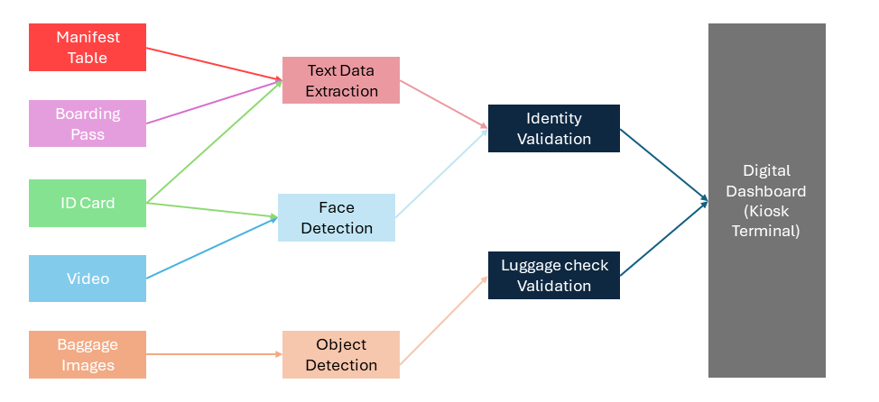
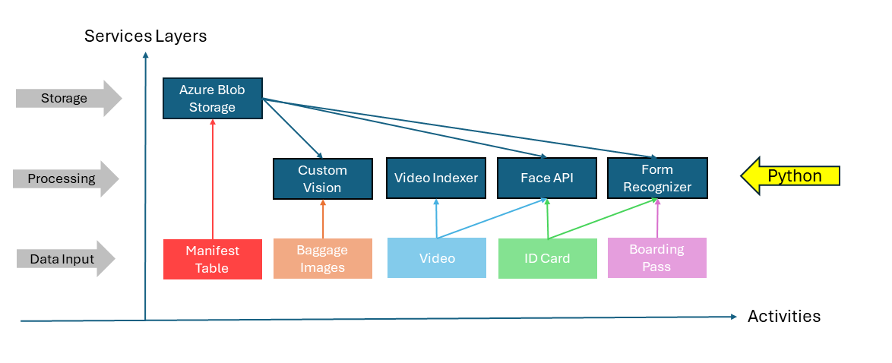

# Project: Automated Passenger Boarding Kiosk

This project aims to develop an automated passenger boarding kiosk leveraging computer vision technology to streamline pre-flight boarding procedures. By utilizing Azure Computer Vision, Face, and Form Recognizer services, along with other cloud resources such as Blob Storage, the system will facilitate various tasks crucial to airline boarding operations. These tasks include identity verification, boarding pass recognition, emotion detection, and lighter detection in carry-on items.

## Introduction

Traditional boarding processes often entail cumbersome manual verification procedures, leading to inefficiencies and potential bottlenecks. The introduction of an automated passenger boarding kiosk offers a promising solution to these challenges. By harnessing the capabilities of computer vision, the system enhances security measures while expediting boarding procedures, ultimately improving the overall passenger experience.

## Requirements

### Scan and Verify Passenger Information

- Scan passenger ID card and boarding pass
- Extract information from boarding pass
- Verify information matches between ID card, boarding pass, and flight manifest on server

### Facial Recognition

- Take a 15-30 second video of the passenger
- Perform facial recognition to match the live person with the ID card

### Prohibited Item Detection

- Scan passenger's carry-on baggage
- Identify any prohibited items
- Stop passenger from boarding if prohibited items found

### Validation and Messaging

- If all validation succeeds, display message that passenger can board plane
- If issues arise, suggest passenger see an airline representative to complete boarding

#### Simulated Kiosk Experience

- Create passenger manifest with 5+ passengers
- Fabricate digital IDs and boarding passes for all passengers in manifest
- Include project owner's fabricated ID and 15-30 second video for face recognition validation
- Scan passenger carry-on items and flag if lighter is present as prohibited item
- Process all data using Azure computer vision services to simulate automated boarding

#### Input Data Sources

- Flight manifest list for 5 passengers
- 5 passenger ID cards
- 5 passenger boarding passes
- 15-30 second video of each passenger's face
- Photo of each passenger's carry-on items



### Azure AI Services Used
* [AI Video Indexer (formerly Video Recognizer) API](https://www.videoindexer.ai)
* [Form Recognizer API](https://fott-2-1.azurewebsites.net/)
* [Custom Vision](https://www.customvision.ai/)
* Face API

## Project Summary

The automated passenger boarding kiosk prototype exemplifies the practical implications of cutting-edge technology in real-world scenarios. By seamlessly integrating Azure services and custom computer vision models, the system demonstrates the feasibility of automating complex processes within the airline industry. From digital ID recognition to emotion detection and beyond, the project showcases how advancements in AI can revolutionize traditional workflows, offering tangible benefits in terms of efficiency, accuracy, and passenger satisfaction. Through the submission of project deliverables via GitHub repositories, participants contribute to the ongoing evolution of AI-driven solutions in the aviation sector, paving the way for future innovations and enhancements in passenger boarding experiences.

## Implementation

### Installation
* All required Python packages can be found in the [*requirements.txt*](step_5_validation_metrics_monitoring/requirements.txt) file (see step 5).
* All environment variables have been stored in a *.env* file at the main folder of this project:

```bash
AZURE_USERNAME=...
AZURE_PASSWORD=.

STORAGE_ACCOUNT_NAME=...
LOCATION=...

AZURE_FORM_RECOGNIZER_ENDPOINT=...
AZURE_FORM_RECOGNIZER_KEY=...
AZURE_BLOB_CONTAINER_SAS_URI=...

VIDEO_RECOGNIZER_SUBSCRIPTION_KEY=...
VIDEO_RECOGNIZER_ACCOUNT_ID=...

FACE_API_KEY=...
FACE_API_ENDPOINT=...

CUSTOM_VISION_TRAINING_ENDPOINT=...
CUSTOM_VISION_TRAINING_KEY=...
CUSTOM_VISION_TRAINING_RESOURCE_ID=...

CUSTOM_VISION_PREDICTION_ENDPOINT=...
CUSTOM_VISION_PREDICTION_KEY=...
CUSTOM_VISION_PREDICTION_RESOURCE_ID=...

STORAGE_ACCOUNT_CONNECTION_STRING=...
```

* For interacting with external services like the [Form Recognizer API](https://fott-2-1.azurewebsites.net/), you need to set up Cross-Origin Resource Sharing (CORS) and generate a Shared Access Signature (SAS) URI to your blob container.

### Solution Strategy

1. Train Azure Form Recognizer model to extract passenger info from boarding passes
2. Use Face API and Form Recognizer to extract face and personal info from digital IDs
3. Validate passenger info from boarding pass against manifest list
4. If name exists in manifest, validate identity from personal ID
5. Verify face from digital ID matches face from passenger video using Video Indexer
6. Train Azure Custom Vision model to identify lighters in carry-on images
7. Test Custom Vision model on sample carry-on images
8. Display final validation success/failure message to complete boarding process


