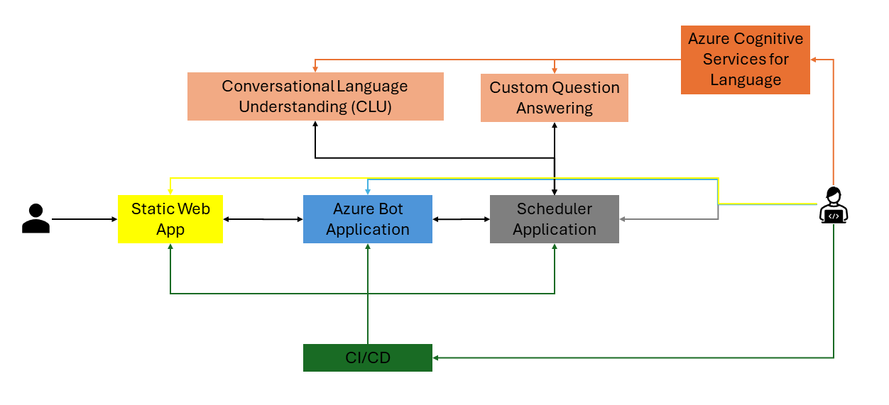
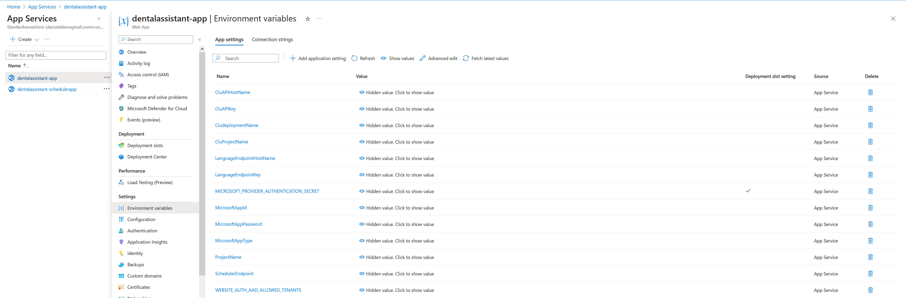

# Project: Dental Office Virtual Assistant

## Introduction
In the modern, bustling world of dental practice, a Dental Office Virtual Assistant stands as a game-changer, becoming an indispensable asset in the industry. This innovation bridges the gap between efficiency and excellent customer service, transforming the way dental practices operate. Harnessing the power of technology and artificial intelligence, it revolutionizes the administrative tasks, ensuring precision, speed, and consistency, while also freeing up valuable time for dental professionals to focus on what truly matters - providing top-notch dental care. The importance of a Dental Office Virtual Assistant cannot be overstated as it creates a seamless, stress-free environment, setting a new standard in the realm of dental practice management.

## Requirements
In order to run the project you need to create the resources on Azure. Also, you need to add a *.env*. file to the folder with following information:

```bash
MicrosoftAppType= # SingleTenant or MultiTenant
MicrosoftAppId= # AppID
MicrosoftAppPassword= # AppPW (needs to be created)
MicrosoftAppTenantId= # TenantID (only for SingleTenant, leave blank for MultiTenant)

ProjectName= # name of the Custom QA project
LanguageEndpointKey= # endpoint key of language service 
LanguageEndpointHostName= # endpoint url, like https://(...).cognitiveservices.azure.com

CluProjectName= # CLU project name
CluAPIKey= # CLU API key
CluAPIHostName= # API URL, like https://(...).cognitiveservices.azure.com"
CludeploymentName= # Deployment name

SchedulerEndpoint= # endpoint URL for scheduler, like https://(...).azurewebsites.net"
```

## Project Summary
This project aims to create a comprehensive dental office virtual assistant using Node.js, Azure Bot, App Service, and other Azure resources. The assistant will be integrated into the Contoso Dentistry website, providing a seamless conversational interface for patients. 

* The **Node.js bot application** serves as the central hub, connecting all services into a single conversational interface. It determines the flow of conversation between patients and the bot, with some of the logic based on feedback from the connected services. The bot application is deployed using Continuous Deployment Reference (GitHub CI/CD with GitHub Actions) and tested using the Microsoft Bot Framework Emulator.

* There a two Azure Cognitive Services for **Language**:
    * The **Custom Question Answering resource** contains the FAQs about the dental office. This allows the bot to answer questions when patients ask them. The Custom Question Answering resource uses natural language processing to interpret user utterances, even if it has never seen the exact phrasing before.

    * The **Conversational Language Understanding (CLU) resource** gives the bot application the ability to determine the intent of the patient’s utterances and extract entities such as the time a patient requests an appointment. CLU helps the app handle requests related to the Dentist Scheduler App.

* The **Dentist Scheduler App** represents a third-party API whose functionality can be integrated into our conversational interface. It is deployed using a Web App resource and Continuous Deployment Reference (GitHub CI/CD with GitHub Actions). When a patient interacts with the bot, their input is processed by the CLU. The CLU interprets the patient's request and determines whether it's a query for the Custom Question Answering resource (for FAQs) or a command for the Dentist Scheduler App (for appointment scheduling). If the intent is to schedule an appointment, the CLU directs the request to the Dentist Scheduler App.

* The **Dentist Website** is the final step of the project, where the bot is deployed. It is created using a static web app resource and Continuous Deployment Reference (GitHub CI/CD with GitHub Actions). The website includes the bot's generated HTML, providing a conversational interface for patients visiting the website.



Throughout the project, the bot's code is continuously updated and tested both locally and in Azure to ensure all services are correctly connected and functioning as expected. The project leverages the power of Azure AI Language, Conversational Language Understanding (CLU), and Custom Question Answering to create an efficient, intelligent, and user-friendly virtual assistant for the dental office.

## Implementation
The Dental Office Virtual Assistant project has been implemented following a structured and step-wise process:

1. **Node.js Bot Application Creation**: The project commenced with the setup of the central hub - the Node.js bot application. An Azure Bot resource and an App Service resource were created in the Azure Portal. The Azure Bot resource's messaging endpoint URL was set to match the App Service's endpoint URL, and a Continuous Deployment Reference (GitHub CI/CD with GitHub Actions) was established for the bot application. Following the installation of dependencies, the bot was initiated and tested using the Microsoft Bot Framework Emulator.


For the bewlow **Language services** only specific regions work, therefore I went for **East US**.

2. **Custom Question Answering Resource Integration**: A Custom Question Answering resource was created to handle FAQs about the dental office. The knowledge base was populated with FAQs, published, and the corresponding keys were added to the bot's environment file and the bot's web app environment variables application settings.


The FAQs for the Custom QA have been exported to *ContosoDentistryFAQs/QnAs.tsv* as well as the project settings to *ContosoDentistryFAQs/Settings.tsv*. There are no synonyms, as you can see in *ContosoDentistryFAQs/Synonyms.tsv*.

3. **Conversational Language Understanding (CLU) Resource Integration**: A CLU resource was integrated to enable the bot to process and understand the intent behind a patient’s utterances. A language understanding resource was added to the resource group, and the necessary intents were created. The CLU model was trained, published, and the corresponding keys were added to the bot’s environment file and application settings.


The intents (`GetAvailability`, `ScheduleAppointment`), entities (`date`), utterances (15 per intent) for the CLU have been stored in *ContosoDentistryFAQs/QnAs.tsv* as well as the project settings in *ContosoDentistryFAQs/CLU.json*.

4. **Dentist Scheduler App Deployment**: The Dentist Scheduler App, a third-party API responsible for appointment scheduling functionality, was deployed. A Web App resource was added to the resource group and a continuous deployment reference was set up. The scheduler API endpoint was then added to the bot's environment file and application settings.

All variables stored in the *.env* file in **ContosoDentistryChatBot** should now be set in the Azure Bot Web App's Environment Variables application settings:



5. **Bot Code Finalization**: All necessary variables in the bot’s environment file were filled in, and the bot's code was updated to create connectors for the Custom Question Answering resource, the Dentist Scheduler, and the CLU. Logic was written to process results from both the CLU and Custom Question Answering resource, and to determine the next action based on these results. A custom greeting was created for the welcome text.

6. **Bot Configuration Verification**: All services were connected to the bot and the environment variables were verified through testing of the application locally with Bot Framework Emulator and in Azure in the Azure Bot's Web Chat.

7. **Dentist Website Creation**: A dentist website was created, and the bot was deployed to it using a static web app resource. The bot's generated HTML was incorporated into the website, providing a conversational interface for patients visiting the website.

By following these steps, a comprehensive and efficient virtual assistant for the dental office was successfully implemented. The having set up the resources, everything should like this:

