# Project: AI-enriched Corporate Training Catalog

## Introduction

An AI-enriched Corporate Training Catalog holds immense significance in today's dynamic business landscape, serving as a potent tool for organizations striving to foster continuous learning and development among their workforce. By harnessing the power of artificial intelligence, companies can personalize learning experiences, identify individual skill gaps, and deliver targeted training content, thereby enhancing employee engagement, productivity, and retention. Moreover, AI enables real-time tracking and analysis of learning progress, allowing businesses to adapt their training strategies swiftly to meet evolving needs and stay ahead in an ever-changing market. In essence, an AI-enriched Corporate Training Catalog not only empowers employees to acquire relevant skills efficiently but also equips organizations with the agility and foresight necessary to thrive in the competitive business environment of today and tomorrow.

## Requirements

To meet the diverse needs of modern organizations and their workforce, this project sets out clear requirements, ensuring a seamless user experience and robust functionality. Below are the key requirements delineating the vision for this transformative tool:

### Search for Courses:

- **Keyword Search**: Users can search Course Data by keywords and phrases from descriptions and other fields.
- **Filtering Options**: Users can filter results based on relevant criteria such as course ratings or duration.
- **Instructor Profile Search**: Users can search course instructors' profiles, even if they are not currently in the database.
- **Faceted Information**: Users can facet information based on source (MS, Udacity, Internal), skills, and role.
- **Sorting Functionality**: Users can sort results by relevant fields.

### Search for Journal Articles:

- **Comprehensive Search Criteria**: Users can search for journal articles by keywords and phrases, authors, associated institutions, publication name, publisher, and publication date.
- **DOI URL Provision**: Users can be provided the DOI (Digital Object Identifier) URL for the PDF as part of the search result.

### Needed Skills:

#### Search for Courses:

- **Key Phrase Extraction**
- **Custom Entity Lookup**

#### Search for Journal Articles:

- **Key Phrase Extraction**
- **Web API**

The requirements of the project are reflected [here](./step_1_design/Step1_Requirements.txt).

## Project Summary

This project aims to develop an AI-Enriched Corporate Training Catalog that consolidates training resources from various sources, including Microsoft, Udacity, internal materials, and open-access journal articles. The goal is to create a user-friendly interface where employees can search for courses and articles based on keywords, filter results by criteria like ratings and duration, and access additional information such as instructor profiles and DOI URLs. To enhance search capabilities, Azure AI Services will be used to enrich data and provide descriptive information about course entities. Additionally, a custom skill will be implemented to query the Springer Nature API for article information. Azure AI Search plays a pivotal role in this project by providing robust search functionalities, facilitating data importation, enrichment, and indexing, and ultimately powering the search engine behind the training catalog.

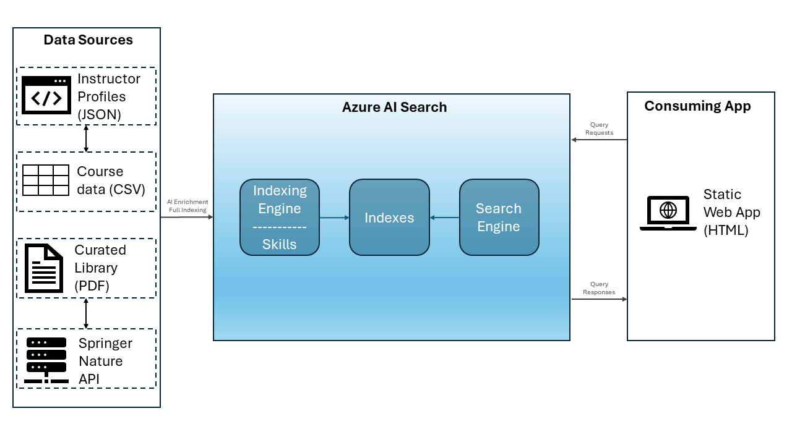

The data available from each data source is outlined below:

### Course Data

- Structured information about various training courses available to employees within the organization.
- This data is utilized within the AI-Enriched Corporate Training Catalog project and serves as the foundation for the training catalog, allowing employees to search, filter, and explore available courses based on their learning needs and preferences.
- Consists of
  - Title
  - Description
  - Duration
  - Source [MS, Udacity, Internal]
  - Type [Module, Nanodegree, Internal]
  - Level
  - Role
  - Technology
  - Popularity
  - Rating
  - Rating Count
  - URL
  - Review (only for internal courses)
  - Instructor (only for internal courses)

The course data is provided [here](./step_2_import_data/Data/courses.csv) and will be later enriched by:

#### Moodle Instructor Profiles

- Contains information about instructors for internal training courses on the Moodle platform.
- Includes instructor names, expertise areas, biographies, and possibly links to their profiles or contact information.

The Moodle instructor profiles data is provided [here](./step_3_enrichments/Data/MoodleInstructorProfiles.json)

### Set of Curated PDF Articles

- Consists of a curated collection of PDF articles.
- Relevant to the company's work, particularly in the field of big data.
- Includes articles from reputable sources related to research, developments, and insights in the field.
- Intended to supplement the training catalog with additional resources beyond courses and modules.
- Users can search these articles by keywords, authors, institutions, publication names, publishers, and publication dates.
- Provides users with access to valuable research and information in PDF format.
- Enhances the training catalog's comprehensiveness and relevance to employees' learning needs.

The curated PDF articles data is provided in this folder [here](./step_2_import_data/Data/Library) and will be later enriched by:

#### Springer Nature API

- Provides access to the Springer database for academic articles.
- Allows querying for information such as article titles, authors, abstracts, publication dates, and digital object identifiers (DOIs).
- Facilitates retrieval of metadata and content from Springer's collection of scientific and technical publications.

The metadata will be retrieved via API through the [Springer Nature's Developer Portal](https://dev.springernature.com/). The API will be read through a lookup function based on .NET provided [here](./step_3_enrichments/Function), deployed with Azure Functions as a Functions app.

## Implementation

The implementation of this project unfolds through a structured approach, systematically addressing various phases essential for the development and deployment of a comprehensive search solution using Azure AI Search. Beginning with meticulous design planning and requirement gathering, the project proceeds to import diverse datasets into the Azure environment, followed by enriching them to enhance search capabilities. Leveraging both built-in and custom skills, the solution integrates external information seamlessly, ensuring a more comprehensive search experience. Finally, deployment culminates in the integration of the solution into a simple web application, showcasing its tangible results and seamless interaction with end-users. Throughout, rigorous adherence to best practices and meticulous testing ensures the effectiveness and reliability of the implemented solution in meeting the outlined project goals and requirements.

**Step 1: Design**
In this initial phase, the project's foundational design is established, laying the groundwork for subsequent implementation steps.

- Architectural Diagram Creation:

  - A high-level architectural diagram is crafted.
  - The diagram illustrates the system's structure, including data sources in Azure and the final user interface.

- Requirements Generation:
  - Detailed requirements are extrapolated from the project narrative.
  - Requirements cover functionalities such as searching, filtering, faceting, and sorting, based on project goals.

**Step 2: Import Data**
This step focuses on importing data from multiple datasets into the Azure environment, setting the stage for data querying and manipulation.

- Data Upload

  - The data has been upload with Azure Storage Explorer
  - The _courses.csv_ file to Azure Tables, the folder with the curated PDF articles to Blob containers.

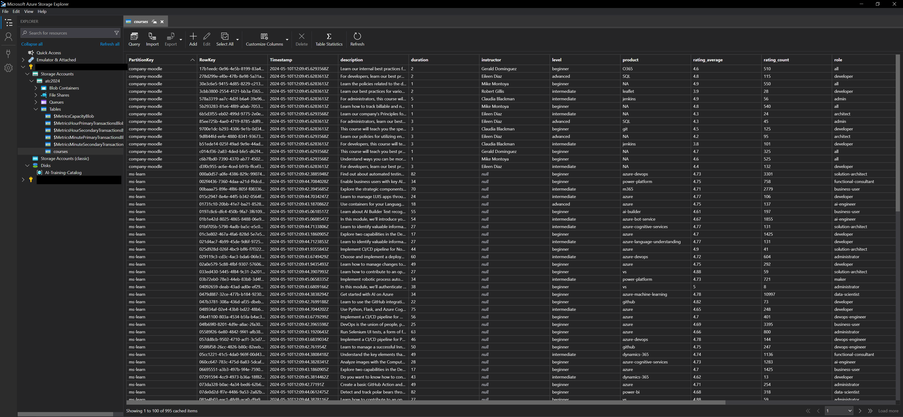
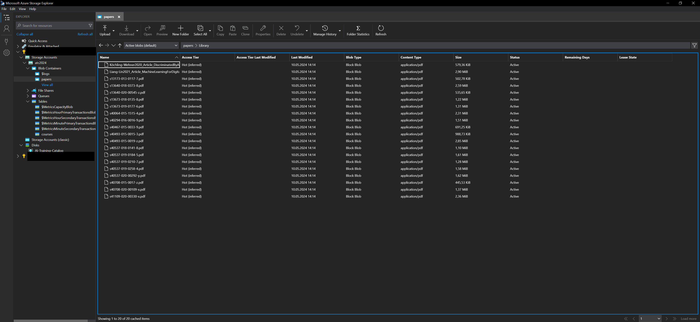

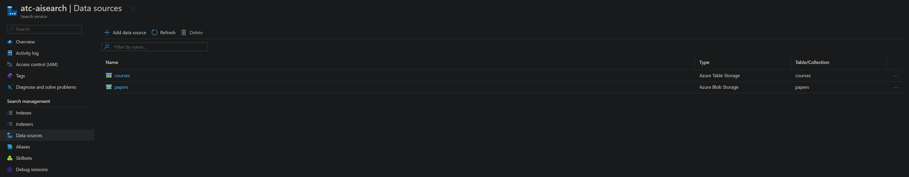

- Data Importation:

  - Utilization of the Import Data wizard to import _courses.csv_ and research papers datasets.
  - Selection of appropriate enrichments during import, aligning with design requirements.

Both sources (csv Table, pdf Blob) have been imported as data sources, each with its Cognitive Skills and Target Index:
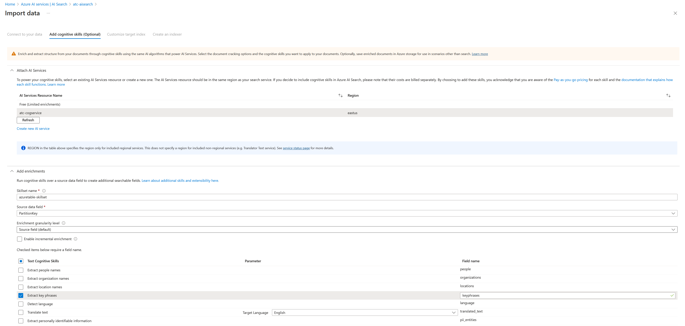

- Target Index Customization:

  - Customization of the target index to facilitate data retrieval, filtering, sorting, faceting, and searching functionalities.

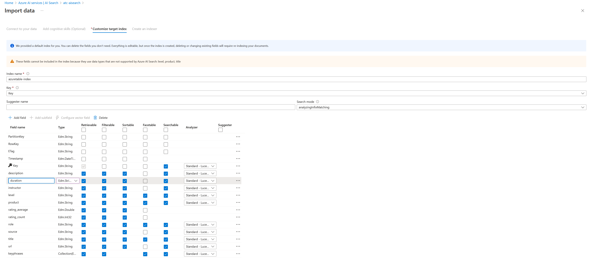

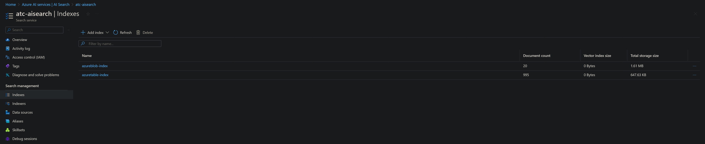
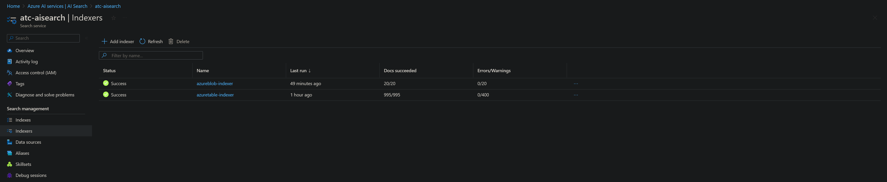

- Query Validation:
  - Use of the Search Explorer interface to validate successful import and query functionalities.

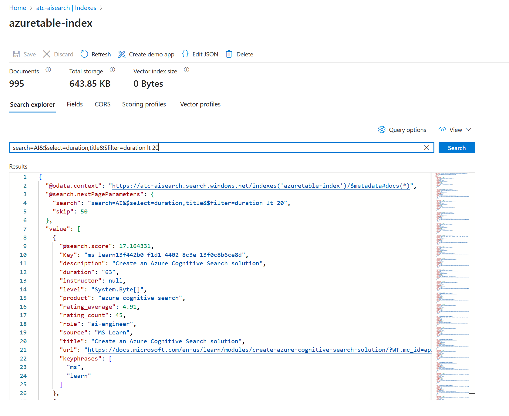

**Step 3: Enrichments**
Enriching the dataset with additional information is the focus of this step, enhancing search capabilities and data relevance.

- Built-in Skill Integration:

  - Implementation as **CustomEntityLookupSkill**
  - Modification of skillset definitions to integrate built-in skills for enriching data with external information.
  - Updating index and indexer files to incorporate the enriched data for querying.

- Custom Skill Development:

  - Implementation as **WebApiSkill**
  - Acquisition of credentials for the Springer API and deployment of the Azure Function for custom skill implementation.
  - Integration of the custom skill into Azure AI Search for enriching data with article information.
  - Also here updating index and indexer files to incorporate the enriched data for querying.

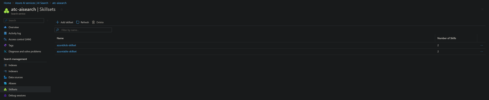
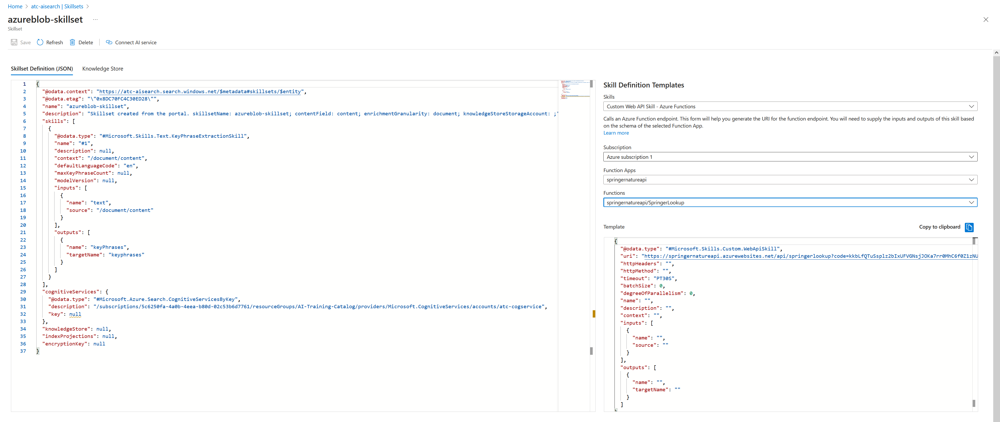

- Validation:
  - Utilization of the Search Explorer interface to validate the effectiveness of enrichments through query demonstrations.

**Step 4: Deployment**
The final step involves deploying the service and integrating it into a simple web application, showcasing the project's functionality.

- Static Website Creation:

  - Configuration of the _index.html_ file to connect the website to the Azure AI Search instance.
  - Deployment of the website and thorough testing to ensure proper functionality.

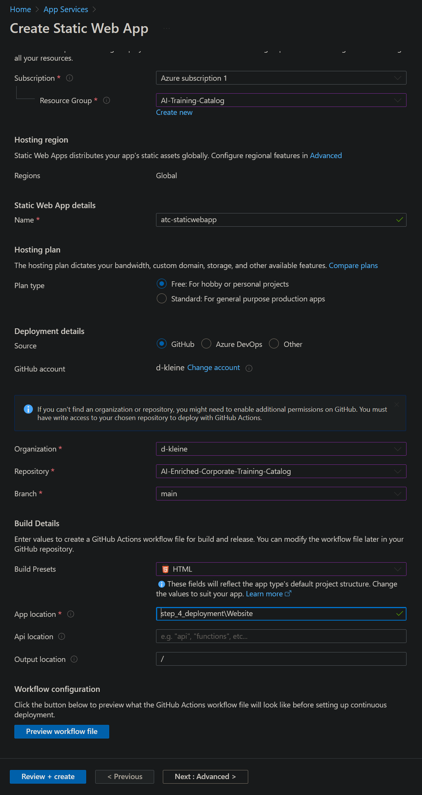
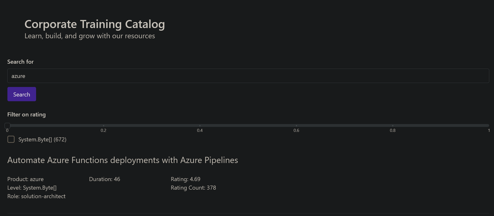

- Testing and Validation:
  - Capture deployment details and performance metrics.

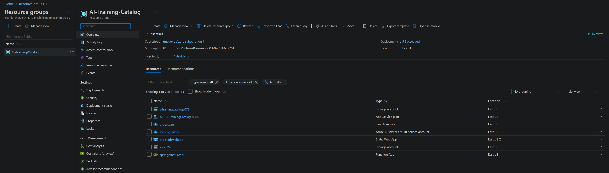

